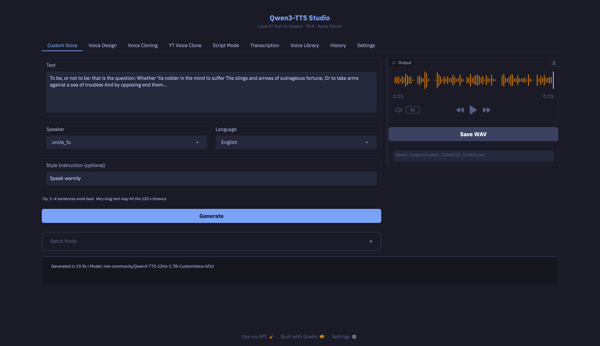

# Qwen3-TTS MLX Studio

Local text-to-speech and speech recognition on Apple Silicon, powered by [Qwen3-TTS](https://huggingface.co/Qwen) and [mlx-audio](https://github.com/Blaizzy/mlx-audio). Runs entirely on-device — no API keys, no internet required after the initial model download.



## Requirements

- A Mac with Apple Silicon (M1, M2, M3, or M4)
- Python 3.10 or newer (3.12 recommended)
- [Homebrew](https://brew.sh) (the installer uses it to set up dependencies)

If you don't have Homebrew yet, open Terminal and paste:

```bash
/bin/bash -c "$(curl -fsSL https://raw.githubusercontent.com/Homebrew/install/HEAD/install.sh)"
```

## Tabs

**Custom Voice** — Generate speech with one of nine built-in speaker presets. Add a style instruction to shape tone, pace, and emotion. Supports batch generation for long texts.

**Voice Design** — Describe a voice in plain language and the model creates it. Designed voices can be saved to the Voice Library. Supports batch generation.

**Voice Cloning** — Clone a voice from a short reference audio clip (3-30 seconds). Provide the clip and an exact transcript of what was spoken. A "Transcribe Reference" button can auto-fill the transcript using the built-in ASR model. Supports batch generation.

**YT Voice Clone** — Clone a voice directly from a YouTube video. Paste a URL, select a timestamp range, and the transcript auto-fills from subtitles. A "Transcribe Clip" button is available when subtitles are missing or inaccurate. Clips are cached in `.yt_cache/`.

**Script Mode** — Write multi-speaker scripts with `SPEAKER: Dialogue` formatting and assign a different voice to each speaker. Lines are batched by model type to minimise swaps, then stitched together with configurable silence gaps.

**Transcription** — Transcribe audio files locally using the Qwen3-ASR model. Upload a file or record with your microphone, pick a language (or leave it on Auto), and get a text transcript. Supports up to ~20 minutes of audio. Transcriptions can be saved as `.txt` files.

**Voice Library** — Browse, preview, rename, delete, and import saved voices. Voices from Voice Design, Voice Cloning, and YT Voice Clone all appear here.

**History** — Every generation is logged with mode, language, text, and duration. Replay audio, save WAV files, or view original parameters.

**Settings** — Model size and quantization, generation parameters (temperature, top-k, top-p, repetition penalty, max tokens, timeout), output directory, auto-save toggle, JIT compilation toggle, ASR model management, YT cache management, and model cache management (view/delete downloaded models).

## Setup

**1. Clone the repository**

Open Terminal and run:

```bash
git clone https://github.com/g2h0/qwen3-tts-mlx-studio.git
cd qwen3-tts-mlx-studio
```

**2. Run the installer**

```bash
./install.sh
```

The installer will:

- Check that you're on Apple Silicon with a compatible Python version (and offer to install one via Homebrew if needed)
- Install ffmpeg if it's missing (required for audio processing)
- Create a Python virtual environment (`.venv/`)
- Install all Python dependencies
- Optionally pre-download the TTS models (~6 GB total) — you can skip this and they'll download automatically the first time you use each mode

## Usage

Start the app:

```bash
./run.sh
```

The UI opens in your browser at `http://localhost:7860`. Press Ctrl+C in the terminal to stop.

**Options:**

```bash
./run.sh --model-size 0.6B   # Smaller, faster model (default: 1.7B)
./run.sh --quant 8bit        # 8-bit quantization (default: bf16)
./run.sh --host 0.0.0.0      # Listen on all interfaces (e.g. access from another device)
./run.sh --port 8080          # Custom port
./run.sh --share              # Create a public Gradio link
```

## Models

### TTS

Three model variants, one per generation mode. Only one is loaded at a time (~6 GB for 1.7B bf16).

| Mode | Variant | Default Repo |
|---|---|---|
| Custom Voice | CustomVoice | `mlx-community/Qwen3-TTS-12Hz-1.7B-CustomVoice-bf16` |
| Voice Design | VoiceDesign | `mlx-community/Qwen3-TTS-12Hz-1.7B-VoiceDesign-bf16` |
| Voice Cloning | Base | `mlx-community/Qwen3-TTS-12Hz-1.7B-Base-bf16` |

### ASR (Speech Recognition)

A single model used for transcription across all tabs. It loads on demand and unloads automatically after each transcription to free memory.

| Model | Repo |
|---|---|
| Qwen3-ASR 1.7B | `mlx-community/Qwen3-ASR-1.7B-8bit` |

TTS and ASR models are mutually exclusive — only one can be in memory at a time. Switching between them is handled automatically.

To pre-download models manually:

```bash
source .venv/bin/activate
huggingface-cli download mlx-community/Qwen3-TTS-12Hz-1.7B-CustomVoice-bf16
huggingface-cli download mlx-community/Qwen3-TTS-12Hz-1.7B-VoiceDesign-bf16
huggingface-cli download mlx-community/Qwen3-TTS-12Hz-1.7B-Base-bf16
huggingface-cli download mlx-community/Qwen3-ASR-1.7B-8bit
```

## Output

Audio is 24 kHz mono WAV (32-bit float), saved to `./outputs/` by default. Transcriptions are saved as `.txt` files in the same directory. Voice library profiles are stored in `./voices/`.

## Supported Languages

English, Chinese, Japanese, Korean, German, French, Russian, Portuguese, Spanish, Italian

## Project Layout

```
app.py            — Gradio UI, tabs, and event wiring
engine.py         — Model load/unload/inference (thread-safe, TTS + ASR)
voice_library.py  — Voice profile storage
yt_voice.py       — YouTube clip extraction and subtitle alignment
audio_utils.py    — Audio concatenation and text splitting
script_parser.py  — Multi-speaker script parser
history.py        — Generation history log
config.py         — Constants and defaults
theme.py          — Dark theme and custom CSS
install.sh        — One-step installer
run.sh            — App launcher
```

## Troubleshooting

**"Virtual environment not found"** — Run `./install.sh` first before `./run.sh`.

**Model download is slow** — The first run downloads ~6 GB from HuggingFace. On a slow connection you can pre-download models (see the Models section above) or let the installer do it.

**Out of memory** — The 1.7B bf16 model uses ~6 GB of unified memory. If you're running low, try `./run.sh --model-size 0.6B` or `./run.sh --quant 8bit` for a smaller footprint.

**ffmpeg not found** — Install it with `brew install ffmpeg`. It's required for audio processing and YouTube clip extraction.

## License

[MIT](LICENSE)
